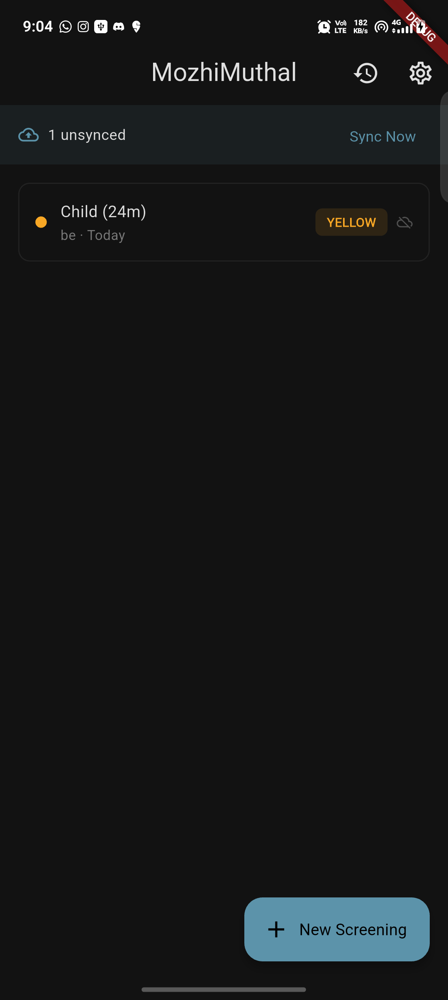
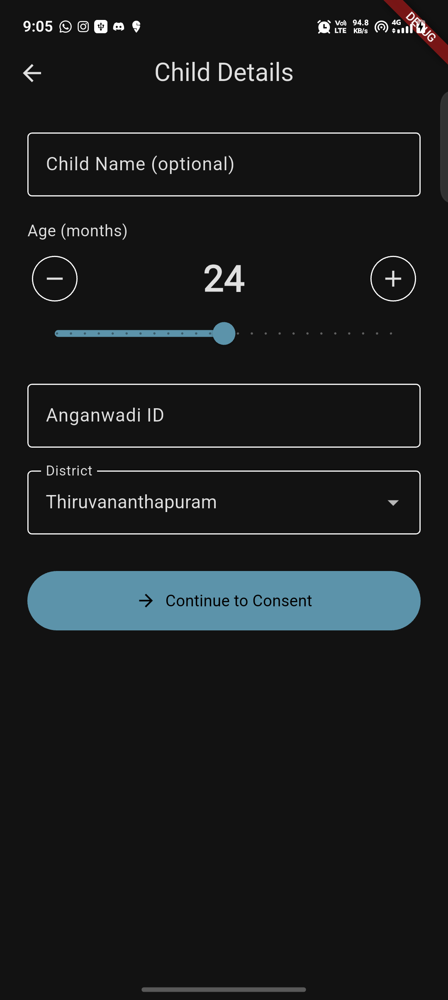
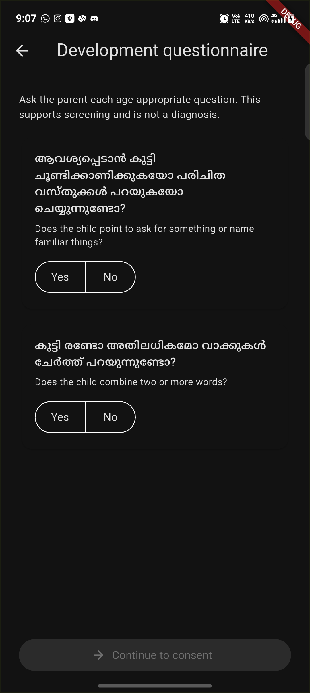
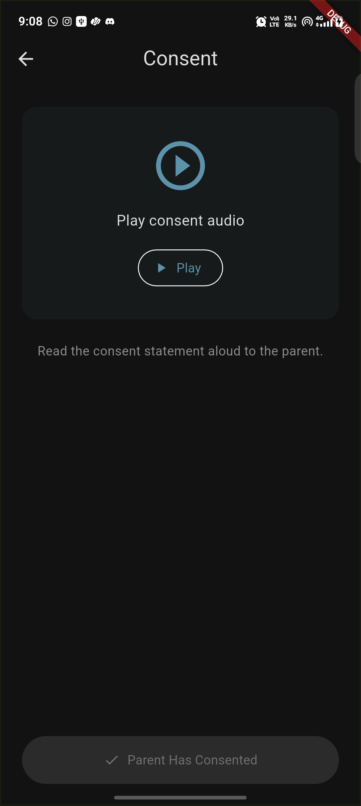
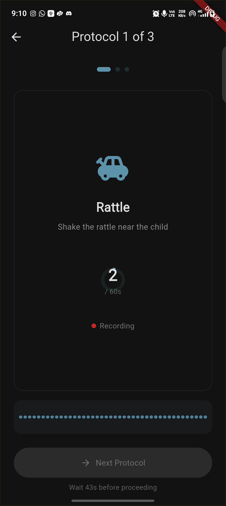
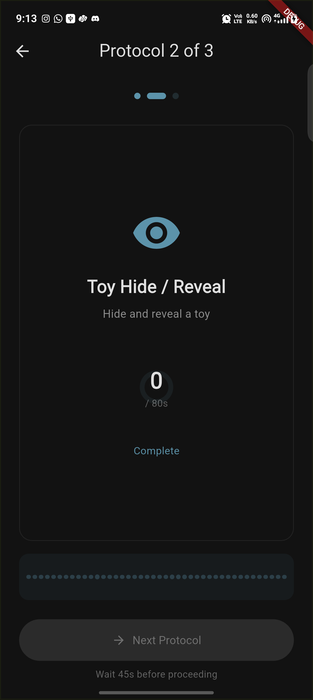
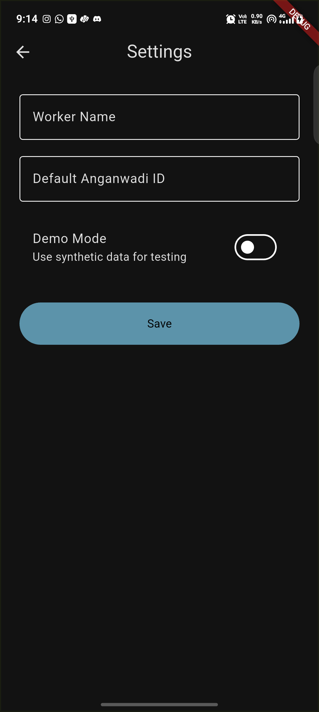
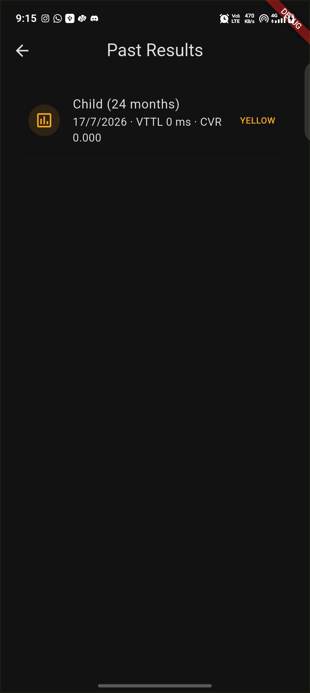

# MozhiMuthal (മൊഴിമുതൽ)

**Acoustic biomarker screening for early childhood developmental assessment in Kerala Anganwadis.**

Replaces biased parent self-reporting with objective, non-semantic acoustic analysis — running entirely on-device on a ₹6,000 Android phone.

> Built for Inclucode Finals | July 2026

---

## Architecture

```
Flutter App (Android)  →  Kotlin Native Pipeline  →  Scoring Engine (Dart)
         ↓                                                    ↓
   SQLite (offline)                                   RED / YELLOW / GREEN
         ↓                                                    ↓
   Supabase (sync)  ←──────────────────────  Next.js DEIC Dashboard
```

## Tech Stack

| Layer | Technology |
|-------|-----------|
| **Mobile App** | Flutter, Riverpod, GoRouter, sqflite |
| **Native Audio** | Kotlin, AudioSource.UNPROCESSED, WebRTC VAD, Pyannote ONNX (INT8) |
| **Scoring** | Dart — threshold rules on VTTL, PFV, CVR biomarkers |
| **Cloud** | Supabase (Postgres + Auth + RLS) |
| **Dashboard** | Next.js 16, Tailwind CSS 4, shadcn/ui |
| **Referrals** | PDF generation + WhatsApp deep link sharing |

## Project Structure

```
mozhimuthal/
├── lib/                    # Flutter app
│   ├── core/               # Theme, routes, constants
│   ├── data/               # Models, repositories, SQLite
│   ├── domain/             # Scoring engine, referral generator
│   ├── presentation/       # Screens, providers
│   └── services/           # Audio pipeline, TTS, WhatsApp
├── android/                # Kotlin native audio pipeline
├── assets/                 # DEIC data, pictograms, audio
├── dashboard/              # Next.js DEIC analytics dashboard
│   └── src/
│       ├── app/            # Pages (overview, districts, screenings)
│       ├── components/     # Sidebar, stat cards, tables
│       └── lib/            # Utilities, mock data
└── supabase/               # Database schema
```

## Screening Flow

1. **Home** — Past sessions list, sync status
2. **Child Profile** — Name (optional), age (12–60 months), Anganwadi ID, district
3. **Consent** — Malayalam audio plays, worker confirms parent consent
4. **Elicitation** — 3 protocols: Rattle (60s), Toy Hide (80s), Imitation (60s)
5. **Processing** — Native pipeline: VAD → Diarize → Feature Extract → Score
6. **Result** — RED / YELLOW / GREEN with Malayalam explanation + biomarker chips
7. **Referral** (RED only) — PDF letter with nearest DEIC address, WhatsApp share

## Android Screen Gallery

Captured on a 1080 × 2408 Android device using the debug build.

| Home | Child details |
| --- | --- |
|  |  |
| Development questionnaire | Consent |
|  |  |
| Elicitation protocol | Protocol 2 state |
|  |  |
| Settings | Past results |
|  |  |

## Biomarkers

| Biomarker | What it measures | Flagged when |
|-----------|-----------------|-------------|
| **VTTL** | Vocal Turn-Taking Latency | > 1000ms |
| **PFV** | Prosodic F0 Variance | std dev < 15 (age ≥ 36m only) |
| **CVR** | Child Vocalization Ratio | Below age-bucketed threshold |

## Getting Started

### Flutter App

```bash
flutter pub get
flutter run
```

### Dashboard

```bash
cd dashboard
npm install
npm run dev
```

## Team

- **Dathan** — Flutter UI/UX, Next.js Dashboard, state management
- **Mathew** — Native audio pipeline, ML models, Supabase backend

## Privacy

- Zero audio leaves the device
- Only 1D numeric feature vectors are synced to cloud
- No child name transmitted unless explicitly enabled
- DPDP Act 2023 compliant
